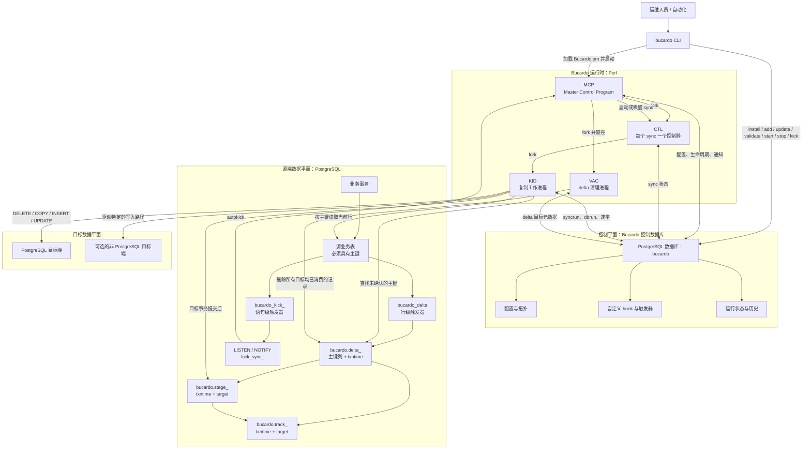
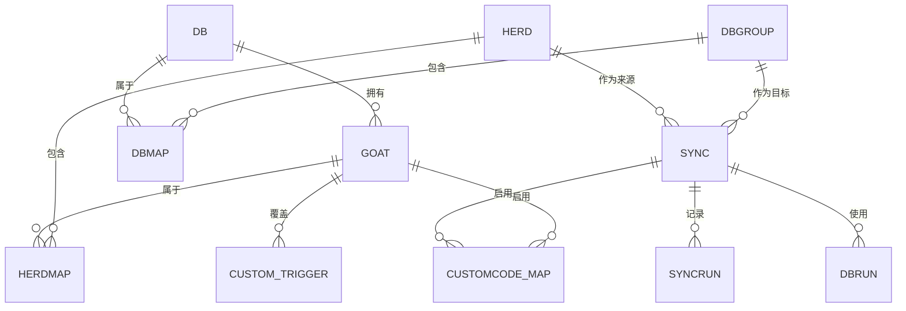
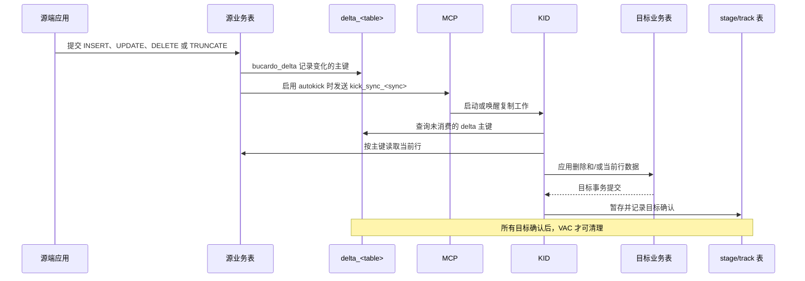
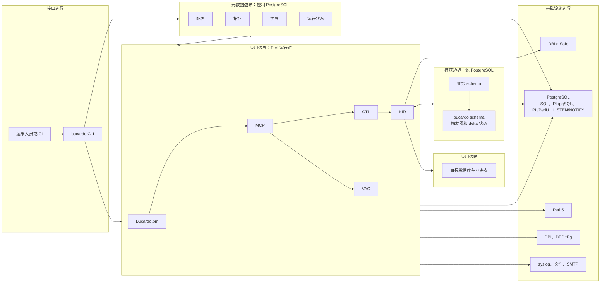

# Bucardo 架构说明

本文档基于当前仓库中的 Bucardo 5.6.0 源码整理，说明运行时进程模型、控制数据库、PostgreSQL 变更捕获，以及复制数据路径。

## 概览

Bucardo 是一个异步、表级复制系统。其架构将**控制平面**与**复制数据平面**分离：

- **控制平面**是名为 `bucardo` 的 PostgreSQL 数据库，用来保存拓扑、配置、扩展定义和运行历史。
- **数据平面**由源库业务表、源库 `bucardo` schema 中动态生成的触发器和 delta 表，以及目标库组成。
- **运行时**是 Perl 进程层级：一个 MCP 守护进程管理多个按 sync 划分的 CTL；CTL 创建 KID 执行复制；可选的 VAC 负责清理已安全消费的 delta 记录。

主要源码文件如下：

| 文件 | 职责 |
|---|---|
| `bucardo` | 命令行接口、安装、配置对象管理和守护进程控制。 |
| `Bucardo.pm` | MCP、CTL、KID、VAC、数据库连接、复制算法、冲突处理、日志和通知。 |
| `bucardo.schema` | 控制库 schema、校验函数、动态触发器安装、delta 维护和升级支持。 |

## 整体架构



## 核心组件

| 组件 | 主要实现 | 职责 | 依赖 |
|---|---|---|---|
| CLI | `bucardo` | 解析参数；安装 Bucardo；管理数据库、表、herd、sync、hook 和守护进程生命周期。 | 控制库、`Bucardo.pm`、DBI |
| 运行时核心库 | `Bucardo.pm` | 各守护进程共用的生命周期、连接、复制、日志、信号和通知逻辑。 | Perl、DBI、DBD::Pg、DBIx::Safe |
| MCP | `start_mcp`、`mcp_main` | 全局守护进程；加载 active sync；监控连接和子进程；接收通知；启动 CTL 与 VAC。 | 控制库、源 PostgreSQL 的 LISTEN 连接 |
| CTL | `start_controller` | 单个 sync 的生命周期管理；处理控制请求；创建 KID；按策略重启工作。 | MCP、sync 元数据、控制库 |
| KID | `start_kid` | 执行一次或持续的复制；读取 delta、回读源表、处理冲突、写入目标并记录完成状态。 | CTL、源库、目标库、控制库 |
| VAC | `fork_vac` | 清理所有配置目标均已消费的 delta 记录。 | 源库 `bucardo` schema、控制库元数据 |
| 控制库 schema | `bucardo.schema` | 创建元数据表、存储函数、校验触发器、源端动态对象和维护函数。 | PostgreSQL、PL/pgSQL、PL/PerlU |
| 变更捕获 | 源端动态触发器和表 | 捕获变动的主键、记录 truncate 事件、按需唤醒 MCP。 | 具有主键的源 PostgreSQL 表 |
| 扩展机制 | `customcode`、`bucardo_custom_trigger` | 注入复制生命周期 hook；按表覆盖 delta 或 triggerkick 行为。 | KID/CTL、DBIx::Safe |
| 可观测性 | `syncrun`、`dbrun`、`bucardo_rate`、日志 | 保存运行历史、当前数据库占用、复制速率、诊断和告警。 | 控制库、syslog/文件/SMTP |

## 进程模型

### MCP：主控程序

MCP 是单例的顶层守护进程，负责：

1. 从控制库加载运行配置与复制拓扑。
2. 建立控制库连接和 PostgreSQL 源端连接。
3. 注册控制通知和 autokick 通知的 LISTEN。
4. 为每个 active sync 创建 CTL。
5. 监测连接健康、子进程和 PID 文件。
6. 在启用且有需求时启动 VAC。
7. 分发 start、stop、pause、resume、reload、kick 等生命周期请求。

### CTL：按 sync 划分的控制器

CTL 管理一个 `sync` 定义。它负责对应 KID 的生命周期，接收 sync 专属的控制事件，并落实 `stayalive`、`kidsalive`、`maxkicks` 和重启策略等设置。

### KID：复制工作进程

KID 执行真实的数据复制。它按数据库角色和能力分组，确定未消费的变化集合，读取源端当前行，写入目标端，处理冲突，并在目标提交后记录消费状态。

### VAC：delta 清理进程

VAC 独立于实际复制执行。它在源端调用 delta 清理函数；只有在所有配置目标组都确认消费后，某个 delta 记录才会被删除。

## 控制数据库模型

控制库不是复制数据的中转库。它保存配置和运行状态；每张表的变更队列位于源库中。



| 元数据区域 | 主要表 | 用途 |
|---|---|---|
| 全局配置 | `bucardo_config` | 保存全局和作用域配置，包括进程、日志和复制行为。 |
| 数据库清单 | `db`、`dbgroup`、`dbmap`、`db_connlog` | 定义连接端点、目标组、角色、优先级和连接历史。 |
| 可复制关系 | `goat`、`herd`、`herdmap` | 定义可复制表/序列，并把源端关系组织为 herd。 |
| 复制定义 | `sync`、`clone` | 将一个 herd 绑定到一个目标数据库组，并定义复制策略。 |
| 映射与 hook | `customname`、`customcols`、`customcode`、`customcode_map`、`bucardo_custom_trigger` | 支持目标端名称/列映射、自定义生命周期代码和触发器覆盖。 |
| 运行记录 | `syncrun`、`dbrun`、`bucardo_rate` | 保存运行历史、当前使用中的数据库会话和可选复制速率。 |
| 维护与诊断 | `upgrade_log`、`bucardo_log_message` | 记录 schema 升级，并支持数据库端向 Bucardo 日志写消息。 |

### 拓扑语义

- **db**：一个命名的数据库连接端点。
- **dbgroup**：经由 **dbmap** 包含一个或多个端点；其中可按场景设置 source、target 或 fullcopy 角色。
- **goat**：一个可复制对象，通常是一张表，也可以是 sequence；表必须有主键元数据。
- **herd**：同一源库中多个 goat 的集合。`herdcheck` 保证同一 herd 内的 goat 来自同一个数据库。
- **sync**：选择一个 herd 与一个目标 dbgroup，并指定 autokick、冲突策略、删除策略、生命周期、隔离级别等运行规则。

## 校验与动态安装

`bucardo.schema` 在 `bucardo.sync` 上安装 `AFTER INSERT OR UPDATE` 触发器。当 sync 的名称、herd、目标组或 `autokick` 设置变化时，会调用 `bucardo.validate_sync`。

校验流程会：

1. 解析 sync 拓扑。
2. 连接所有涉及的数据库。
3. 检查关系是否存在、列是否兼容、关系类型及主键。
4. 创建或确认源端 delta、track 和 stage 表。
5. 安装默认的 delta、truncate 和 autokick 触发器函数。
6. 更新供 delta 查询和安全清理使用的控制元数据。

`bucardo_custom_trigger` 中的自定义条目可按 goat 替换默认 delta 或 triggerkick 函数。

## 变更捕获

对每一张源表，校验过程会创建名为 `bucardo_delta` 的行级触发器：

```sql
CREATE TRIGGER bucardo_delta
AFTER INSERT OR UPDATE OR DELETE ON source_schema.source_table
FOR EACH ROW
EXECUTE PROCEDURE bucardo.delta_<makername>();
```

生成的 delta 表保存源表主键与事务时间：

```text
bucardo.delta_<makername>
  <主键列 1>  与源表类型相同
  <主键列 N>  与源表类型相同
  txntime     timestamptz NOT NULL DEFAULT now()
```

该表在 `txntime` 上有索引，并在全部主键列上有第二个索引。它故意不保存操作类型或完整行镜像。

| 源端操作 | delta 行为 |
|---|---|
| `INSERT` | 写入 `NEW` 主键。 |
| `UPDATE` | 写入 `OLD` 主键；若主键发生变化，再写入 `NEW` 主键。 |
| `DELETE` | 写入 `OLD` 主键。 |

因此，KID 会在复制时按主键重新读取源表。若变化的行已不存在，该记录会进入目标端删除路径。delta 表允许重复记录，后续的查询、确认和清理逻辑会处理它们。

### TRUNCATE

在 PostgreSQL 8.4 及更高版本，校验还会创建 `AFTER TRUNCATE FOR EACH STATEMENT` 触发器。其 `bucardo_note_truncation` 函数会把事件记录进 `bucardo_truncate_trigger`，并清空该关系的 delta、track 和 stage 表。因此，truncate 表示为表级事件，而不是逐行生成 delta。

## 复制与确认路径



每个关系关联的状态对象如下：

| 对象 | 结构 | 用途 |
|---|---|---|
| `delta_<makername>` | 源表主键列加 `txntime` | 耐久化的源端变更队列。 |
| `stage_<makername>` | `txntime`、`target` | 与目标提交处理关联的确认前暂存状态。 |
| `track_<makername>` | `txntime`、`target` | 持久记录某目标已经消费变化。 |
| `bucardo_delta_names` | sync、表、delta 名称、track 名称 | 将 sync/关系映射到实际生成的物理表名。 |
| `bucardo_delta_targets` | 源表 OID、目标组 | 指明清理前必须消费某项 delta 的目标组。 |

## 通知与 Autokick

当 `sync.autokick` 启用时，校验会为每张受跟踪源表创建一个语句级触发器。其名称通常为 `bucardo_kick_<syncname>`，但会受 PostgreSQL 标识符长度限制调整。

该触发器在 `INSERT`、`UPDATE`、`DELETE` 以及可用时的 `TRUNCATE` 后执行。默认触发器函数发送：

```text
PostgreSQL 9.0+：NOTIFY bucardo, 'kick_sync_<syncname>'
较旧 PostgreSQL：NOTIFY "bucardo_kick_sync_<syncname>"
```

MCP 在相关源库连接上监听通知。收到 `kick_sync_<syncname>` 后，它会将 active 且未暂停的 sync 标记为待运行。来自 KID backend 的通知会被忽略，避免“目标端同时又是源端”时产生复制循环。

PostgreSQL 的通知事务语义是该机制的基础：

- 监听者只能在发送通知的事务**提交后**收到通知。
- 若事务回滚，delta 写入和通知都会回滚。
- PostgreSQL 9.0+ 中，Bucardo 复用 `bucardo`、`bucardo_ctl` 或 `bucardo_kid` channel，并以 payload 识别消息；旧版本使用每条消息专属的 channel 名。

## 模块边界



| 边界 | 包含内容 | 不包含的职责 |
|---|---|---|
| CLI | 参数解析、交互式管理、对象 CRUD、进程控制。 | 长时间运行的复制循环。 |
| 运行时 | MCP、CTL、KID、VAC、调度、连接管理、冲突处理、日志。 | 持久业务数据的所有权。 |
| 控制元数据 | 拓扑、策略、扩展、运行历史。 | 源端变更队列与目标端业务行。 |
| 源端捕获 | 源业务表、动态触发器、delta/track/stage 表、通知。 | 目标冲突解决和目标写入。 |
| 目标应用 | 目标业务表及特定数据库的写入行为。 | 标准源端 delta 生成。 |
| 扩展 | 自定义触发器函数与生命周期 hook。 | 绕开事务安全或 DBIx::Safe 的限制。 |
| 基础设施 | PostgreSQL、Perl、数据库驱动、日志和邮件设施。 | Bucardo 的 herd、goat、sync 拓扑语义。 |

## 外部依赖

Perl 运行时至少需要：

- Perl 5.8.3 或更高版本
- PostgreSQL 8.2 或更高版本
- `DBI`
- `DBD::Pg`
- `DBIx::Safe`

控制库 schema 使用 PostgreSQL 服务端语言。至少一个数据库需要提供 PL/pgSQL 与 PL/Perl。PostgreSQL 提供完整的源端变更捕获能力；Bucardo 对多种非 PostgreSQL 数据库类型和 flatfile 也包含目标端能力路径。
