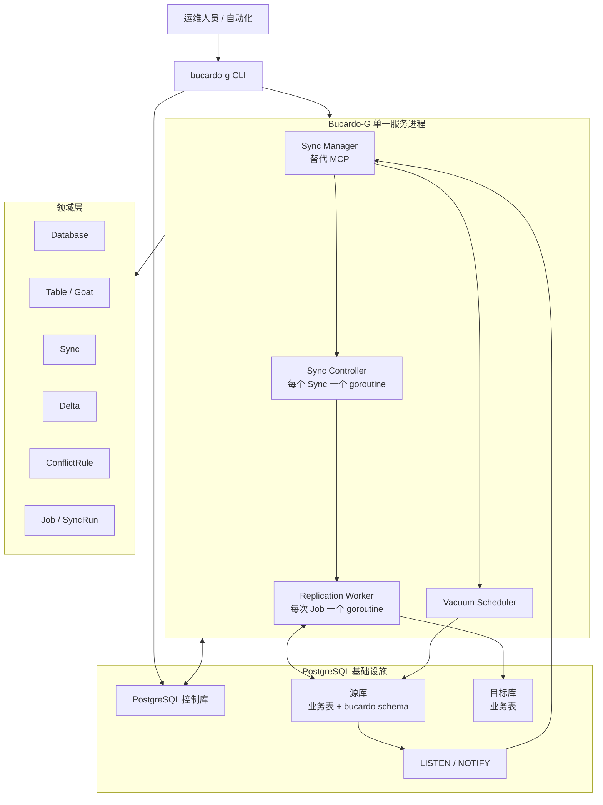
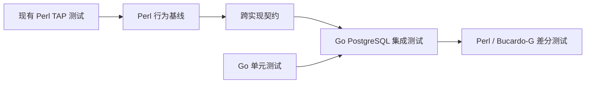

# Bucardo-G 重构方案

## 1. 目标与约束

**Bucardo-G** 是 Bucardo 的 Go 重构项目，用于与现有 Perl 实现区分。

本方案基于 [ARCHITECTURE.md](./ARCHITECTURE.md) 与
[DOMAIN_MODEL.md](./DOMAIN_MODEL.md)，并采用以下明确约束：

1. **仅支持 PostgreSQL 作为源端和目标端。**不迁移 MySQL、MariaDB、MongoDB、Redis、SQLite、Oracle、Firebird、Drizzle、flatfile 等异构数据库适配器。
2. **必须支持 Windows 和 Linux 部署。**不能依赖 `fork`、`setsid`、POSIX-only 信号、`/tmp` 路径或 Unix-only 守护化方式。
3. 首期目标是**行为兼容的运行时替换**：继续兼容既有控制库、源端触发器、delta/track/stage 表和关键运行记录。
4. 重构期间，Perl Bucardo 与 Bucardo-G **不得同时消费同一个 Sync** 的 delta。

非目标：

- 首期不要求字节级复刻原 Perl CLI 的所有输出文案。
- 首期不迁移 Perl `customcode` 为 Go 代码。
- 首期不替换所有 PostgreSQL 服务端函数；先保留兼容对象，再逐步用 Go 校验器替代部署路径。

## 2. 可行性结论

### 结论

**可行，并且 PostgreSQL-only 会显著降低重构风险。**

原项目的关键复制语义已经主要落在 PostgreSQL 中：

- 控制库保存 `Database`、`Table`、`Sync`、`Job` 等配置与运行记录；
- 源端 `bucardo_delta` 触发器将变化主键写入 `delta_*`；
- `track_*` 和 `stage_*` 表保存目标端消费确认；
- `LISTEN/NOTIFY` 将 autokick 事件交给调度器；
- KID 读取 delta 后按主键回读源表，并向目标端应用数据。

这些都可由 Go 的 PostgreSQL 驱动直接实现。移除异构目标后，Bucardo-G 只需实现一条可靠的数据通路：

```text
PostgreSQL Source -> PostgreSQL Target
```

需要特别重视的高风险点不是 Go 本身，而是：

1. delta、track、stage 确认顺序错误导致重复或丢失；
2. 多源同主键变更时的 ConflictRule 行为不兼容；
3. 旧 `validate_sync` 与新 Go 校验器同时部署对象造成差异；
4. 将 Unix `fork` 进程模型直接照搬到 Windows；
5. Perl customcode 所覆盖的生产 Sync 无法直接切换。

## 3. Bucardo-G 的目标架构



### 3.1 进程模型：从多进程转为单服务、多 goroutine

原 Bucardo 的 MCP、CTL、KID、VAC 使用 `fork` 形成进程树。Bucardo-G 推荐默认模型为单个 `bucardo-g serve` 进程：

| 原角色 | Bucardo-G 角色 | 跨平台实现 |
|---|---|---|
| MCP | `SyncManager` | 主 goroutine，加载配置、监听通知、调度 Sync。 |
| CTL | `SyncController` | 每个 active Sync 一个受控 goroutine。 |
| KID | `ReplicationWorker` | 每次 Job 创建一个 goroutine；同一 Sync 同时最多一个活动 Job。 |
| VAC | `VacuumScheduler` | 定时或按任务运行的 goroutine。 |

这样能够保留原有的责任隔离和 Sync 级故障隔离，同时消除 Windows 无法使用 `fork` 的问题。

### 3.2 跨平台进程控制

| 能力 | Linux | Windows | Bucardo-G 设计 |
|---|---|---|---|
| 后台运行 | systemd service | Windows Service / Task Scheduler | 核心二进制以前台服务方式运行，由平台服务管理器托管。 |
| 停止 | `SIGTERM` / `SIGINT` | Service Control Manager stop、Console Ctrl+C | 统一映射到 `context.CancelFunc`，执行优雅关闭。 |
| 重载 | `SIGHUP` 可选 | 无等价 POSIX 信号 | CLI 通过控制库通知或本地管理 API 发起 reload。 |
| PID 文件 | 可选 | 可选 | 不作为正确性依据；使用控制库租约防止双运行。 |
| 临时文件 | `/tmp` | `%TEMP%` | 使用 `os.MkdirTemp`；不要写死路径。 |
| 日志 | journald/syslog | Event Log 或文件 | 统一结构化日志输出到 stdout/文件；平台适配器可选。 |

### 3.3 单实例与 Sync 互斥

单一 Go 进程并不足以防止多个实例重复消费 delta。Bucardo-G 应使用**控制库中的数据库租约**实现分布式互斥：

1. 以 `sync.name` 派生 PostgreSQL advisory lock key；
2. Controller 启动时在控制库连接上获取 session-level advisory lock；
3. 获取失败时，该实例不得执行该 Sync；
4. 连接断开后 PostgreSQL 自动释放锁；
5. Job 开始前仍检查 `syncrun` 中是否存在 `ended IS NULL` 的活动记录；
6. Job 结束、进程取消或发生 panic 时，以 `defer` 结束 Job 并释放资源。

这比依赖 Unix PID 文件更适合 Windows、Linux 和多实例部署。

## 4. 领域模型到 Go 模块的映射

| 领域模型 | Go 包建议 | 核心职责 | 与现有实现的兼容点 |
|---|---|---|---|
| `Database` | `internal/domain/database` | 端点、状态、角色、连接能力。 | 读取 `db`、`dbgroup`、`dbmap`。 |
| `Table` | `internal/domain/table` | Goat、主键、列元数据、Herd 成员关系。 | 读取 `goat`、`herd`、`herdmap`。 |
| `Sync` | `internal/domain/sync` | 复制策略、状态转换、拓扑解析。 | 读取 `sync` 和关联元数据。 |
| `Trigger` | `internal/postgres/trigger` | 幂等安装/检查 delta、kick、truncate trigger。 | 保留 `bucardo_delta`、`bucardo_kick_*` 命名与语义。 |
| `Delta` | `internal/replication/delta` | 读取待处理 delta、建立确认、判断可清理。 | 保留 `delta_*`、`track_*`、`stage_*` 格式。 |
| `ConflictRule` | `internal/replication/conflict` | 多源冲突检测和获胜者选择。 | 兼容 `bucardo_latest`、`bucardo_latest_all_tables`、来源优先级、`bucardo_abort`。 |
| `Job` | `internal/domain/job` | `syncrun` / `dbrun` 生命周期和计数。 | 保留运行状态可观测性。 |
| `Worker` | `internal/runtime` | Manager、Controller、Worker、Vacuum 的协作。 | 用 goroutine 替代 `fork`。 |
| PostgreSQL 访问 | `internal/postgres` | `pgx` 连接、事务、COPY、LISTEN/NOTIFY、advisory lock。 | 替代 DBI/DBD::Pg。 |
| 控制库访问 | `internal/controlstore` | Repository 和事务边界。 | 首期沿用现有控制库表。 |
| CLI | `cmd/bucardo-g` | 安装、校验、控制和状态查询。 | 可逐步提供旧命令子集。 |

## 5. PostgreSQL-only 功能范围

### P0：必须实现

| 能力 | 说明 |
|---|---|
| 控制库读取 | 读取 Database、Table、Herd、Sync 与目标组拓扑。 |
| PostgreSQL 源/目标连接 | 使用 `pgx`；支持 DSN 和 service 配置。 |
| Sync 校验 | 校验源/目标表、列、主键和命名。 |
| Delta 对象部署 | 创建/检查 `delta_*`、`track_*`、`stage_*`，及其索引。 |
| 行级 delta 捕获 | 兼容 `bucardo_delta` 的 INSERT/UPDATE/DELETE 语义。 |
| 手工 kick | 通过 CLI 或控制库请求执行指定 Sync。 |
| 单源单目标复制 | INSERT、UPDATE、DELETE；目标成功提交后再确认。 |
| Job 记录 | 写入和结束 `syncrun`，维护 `dbrun`。 |
| 空轮次与重试 | 无 delta 标为 empty；失败不提前确认 Delta。 |
| Windows/Linux | 构建、服务启动、优雅停止、路径处理、测试均跨平台。 |

### P1：生产级 PostgreSQL 能力

| 能力 | 说明 |
|---|---|
| `LISTEN/NOTIFY` autokick | 事务提交后收到 `kick_sync_<sync>` 并调度 Job。 |
| 多目标 | 每个目标分别确认；VAC 等待所有必需确认。 |
| 多源 | 合并多个来源的 delta 集合。 |
| 冲突策略 | 来源优先级、`bucardo_latest`、`bucardo_latest_all_tables`、`bucardo_abort`。 |
| TRUNCATE | 兼容 truncate 事件、目标应用和日志。 |
| VAC | 安全清理 delta、track 与相关记录。 |
| 故障恢复 | stalled、重连、Sync 隔离、服务重启恢复。 |
| sequence | 读取并向目标调整 sequence。 |
| 映射 | `customname`、`customcols`。 |
| 控制命令 | pause、resume、reload、stop、status、inspect。 |

### 明确不迁移

以下现有能力从 Bucardo-G 范围中排除：

- `20-drizzle.t`
- `20-firebird.t`
- `20-mariadb.t`
- `20-mongo.t`
- `20-mysql.t`
- `20-oracle.t`
- `20-redis.t`
- `20-sqlite.t`
- 非 PostgreSQL 连接能力、方言、事务和目标写入逻辑

控制库中的 `db.dbtype` 字段可暂时保留以读取旧库，但 Bucardo-G 校验器应拒绝任何非 `postgres` 的参与 Database，并给出明确错误。

## 6. 分阶段实施步骤

### 当前实现状态：首个可运行 MVP

Bucardo-G 当前已具备一个 PostgreSQL-only 的单次复制 MVP，可使用现有 Bucardo
控制库配置运行：

```text
go run ./cmd/bucardo-g -control-dsn "<控制库连接串>" -sync "<sync 名称>"
```

该命令会读取 active sync 的单源、单目标和 herd 表定义，读取源端已有的
`bucardo.delta_<schema>_<table>`，将当前行以 PostgreSQL `INSERT ... ON CONFLICT`
写入目标端；源行已删除时在目标端删除；目标事务提交后向源端
`track_<schema>_<table>` 写入确认，并在控制库写入 `syncrun`。
执行前会在控制库获取该 sync 的 PostgreSQL session advisory lock，避免多个 Bucardo-G
实例同时消费同一 sync 的 delta；进程结束或锁连接关闭时锁自动释放。

当前 MVP 的明确边界：

- 只处理 PostgreSQL 到 PostgreSQL；
- 每次命令执行一个 sync，目标组取优先级最高的一个 active target；
- 单次执行有 Sync 级互斥；尚未实现常驻 Controller 的租约和恢复管理；
- 只处理带主键的普通表；
- 暂不包含 LISTEN/NOTIFY 自动调度、多源冲突、TRUNCATE、sequence、VAC 和 custom code；
- 依赖源端已经由 Bucardo schema 安装并维护 delta/track 表及触发器。

advisory lock 的互斥和释放已通过 PostgreSQL 集成测试验证；测试库通过
`BUCARDO_TEST_CONTROL_DSN` 指定。

因此该入口用于逐步验证复制语义，不等同于完整替换 MCP/CTL/KID 运行时。

## 阶段 0：冻结兼容性契约

**目标：** 明确重构期间不可改变的语义。

1. 将现有 Perl 版本作为 oracle。
2. 将 `ARCHITECTURE.md` 的控制面/数据面分离作为模块边界。
3. 将 `DOMAIN_MODEL.md` 中的八个领域对象作为 Go API 边界。
4. 为 P0/P1 列出可观察合同：
   - 控制库读取结果；
   - 动态创建的 trigger/function/table/index；
   - Delta、Track、Stage 的记录关系；
   - `syncrun`、`dbrun` 的状态；
   - 最终业务表数据；
   - NOTIFY 的 channel/payload 与提交语义；
   - 冲突结果；
   - 清理前提。
5. 为每个合同关联遗留测试。

**完成条件：** P0 行为都有明确的输入、输出、失败结果和遗留测试来源。

## 阶段 1：建立 Bucardo-G 工程与跨平台基础

**目标：** 在 Windows 和 Linux 上可构建、可运行、可执行 PostgreSQL 集成测试。

建议项目结构：

```text
bucardo-g/
  cmd/bucardo-g/
  internal/
    controlstore/
    domain/
    postgres/
    replication/
    runtime/
    validation/
    observability/
  migrations/
  test/
    integration/
    contract/
    fixtures/
```

实施项：

1. 初始化 Go module。
2. 使用 `pgx/v5` 与 `pgxpool`。
3. 使用标准 `context` 管理全部长生命周期循环。
4. 使用 `os.UserConfigDir`、`os.UserCacheDir` 和 `os.MkdirTemp`；禁止硬编码 `/tmp`。
5. 输出 JSON 或 key-value 结构化日志到 stdout；文件日志路径由配置指定。
6. 实现服务取消：
   - Linux：接收 `SIGINT`、`SIGTERM`；
   - Windows：接收 Console Ctrl+C 或 Windows Service stop；
   - 两者统一调用 root context cancel。
7. 以 PostgreSQL advisory lock 实现 Sync 排他。

**完成条件：** 同一二进制可在 Windows 和 Linux 构建；可连接控制库、列出 active sync，并获得/释放指定 Sync 锁。

## 阶段 2：控制库读取与 Go Validator 影子模式

**目标：** Bucardo-G 可以正确理解现有数据库配置，但尚不承担复制。

1. 实现 Database、Table、Sync、Job 的 repository。
2. 实现 sync 拓扑解析：
   - 源 Herd；
   - source Database；
   - target DatabaseGroup；
   - dbmap role/priority；
   - Table 的主键和映射。
3. 实现 PostgreSQL catalog introspection。
4. 实现兼容命名算法：
   - `delta_<makername>`；
   - `track_<makername>`；
   - `stage_<makername>`；
   - `bucardo_kick_<sync>`；
   - truncate trigger 名称。
5. 先调用既有 `validate_sync` 完成对象部署；Bucardo-G 只进行影子校验和计划输出。
6. 将 Go 的校验计划和 Perl 的实际对象比对。

**完成条件：** 对 P0 fixture，Go Validator 识别的源表、目标表、主键、生成对象名和兼容性结论与 Perl 一致。

## 阶段 3：单源单目标复制 Worker

**目标：** 实现不含 autokick 的核心数据通路。

执行顺序：

1. 取得 Sync advisory lock。
2. 创建 `syncrun` 与 `dbrun` 记录。
3. 设置源/目标事务的时区和隔离级别。
4. 查询 `delta_*` 中对当前目标未确认的记录。
5. 按主键读取源端当前数据。
6. 计算删除集合和待写入行集。
7. 通过 PostgreSQL 批量写入路径应用到目标端。
8. 仅在目标端 commit 成功后更新 `stage_*` / `track_*`。
9. 结束 Job：
   - success -> `lastgood`；
   - empty -> `lastempty`；
   - failure -> `lastbad`。
10. 使用 `defer` 清理 dbrun、关闭连接并释放 Sync 锁。

**完成条件：** INSERT、UPDATE、DELETE、重复 Delta、目标端失败重试和空轮次都能通过集成测试。

## 阶段 4：Sync Manager、Controller 与 autokick

**目标：** 用跨平台服务运行时取代 MCP/CTL。

1. 实现 `bucardo-g serve`。
2. Manager 定期读取 active Sync 并创建或停止 Controller。
3. 每个 Controller 串行化本 Sync 的 kick、定时检查和 Job 创建。
4. 用 `pgx.Conn.WaitForNotification` 监听源端：
   - PostgreSQL 9.0+：`bucardo` channel + payload；
   - 可根据支持策略只支持当前 PostgreSQL payload 形式。
5. 将通知映射为 `kick_sync_<sync>`。
6. 仅在发送通知的事务提交后调度；此行为由 PostgreSQL 保证，测试必须验证。
7. 识别本服务所持有 backend PID，忽略由复制写入触发的循环 kick。
8. 使用控制库通知或 CLI API 实现 reload，不依赖 `SIGHUP`。

**完成条件：** Windows 和 Linux 上都能在 autokick=true 时自动复制，并能优雅停止。

## 阶段 5：多源、ConflictRule、TRUNCATE 与 VAC

**目标：** 覆盖 PostgreSQL 多主复制的核心复杂性。

1. 合并多 source 的 delta 主键集合。
2. 以 `Table + PrimaryKey` 检测冲突。
3. 实现 ConflictRule：
   - 明确来源优先级；
   - `bucardo_latest`；
   - `bucardo_latest_all_tables`；
   - `bucardo_abort`。
4. 对 `bucardo_custom` 明确报告“不支持”；含 Perl customcode 的 Sync 不允许迁移到 Bucardo-G。
5. 读取和应用 `bucardo_truncate_trigger`。
6. 实现 VAC，并根据 `bucardo_delta_targets` 与 track 确认状态清理。
7. 实现不可达数据库、stalled 和重连恢复。

**完成条件：** 多源冲突、truncate、清理和节点短暂故障均可自动回归验证。

## 阶段 6：Go Validator 取代旧部署路径与灰度切换

**目标：** Bucardo-G 可独立运行。

1. 将阶段 2 的 Go Validator 从影子模式改为执行模式。
2. 所有 DDL 必须幂等，并与旧命名/表结构兼容。
3. 提供 `bucardo-g validate sync <name>`。
4. 提供 Sync 级 runtime 选择，例如控制库扩展表：

```text
sync_runtime
  sync_name
  runtime        -- perl 或 go
  updated_at
```

5. 切换步骤：
   - 暂停目标 Sync；
   - 等待正在执行的 Job 结束；
   - 确认无 `ended IS NULL` 的 `syncrun`；
   - 停止 Perl 对应 CTL/KID；
   - 启动 Bucardo-G Controller；
   - 执行一轮手工 kick；
   - 比对业务表、Delta、Track 和 Job 状态；
   - 观察 autokick；
   - 必要时切回 Perl。

**完成条件：** 可以按单个 Sync 灰度迁移和回退，而不是一次切换整个实例。

## 7. 测试迁移策略

## 7.1 保留 Perl 测试作为行为 oracle

现有 [`t/`](./t/) 测试使用真实 PostgreSQL cluster、真实触发器、真实 daemon 和真实 CLI；它们是最可靠的行为规格。不要先删除或重写它们。

迁移期间应并行维护：

1. **Perl 回归测试**：证明旧 oracle 未变化。
2. **Go 单元测试**：测试无数据库的领域规则。
3. **Go PostgreSQL 集成测试**：验证 Bucardo-G。
4. **差分测试**：同一 fixture 下比较 Perl 与 Bucardo-G 的可观察结果。



## 7.2 测试基础设施：Windows 与 Linux

### 推荐方式：Docker Compose 或 Testcontainers

测试不应直接复用 `t/BucardoTesting.pm` 的 Unix 假设，例如 `/tmp`、`whoami`、命令行 `initdb`/`pg_ctl` 和 POSIX 进程控制。建议使用 Docker 运行 PostgreSQL：

| 平台 | 推荐运行方式 |
|---|---|
| Linux CI | Docker Engine + Docker Compose 或 testcontainers-go。 |
| Windows 开发机 | Docker Desktop（Linux containers）+ Docker Compose 或 testcontainers-go。 |
| 无 Docker 的 Linux CI | Go 测试 harness 管理 `initdb`/`pg_ctl`，作为次选方案。 |
| 无 Docker 的 Windows | 只运行单元/契约测试；完整 PostgreSQL 集成测试在 Docker 或专用 Linux CI 执行。 |

推荐每个测试 run 创建独立 Docker network，并至少提供：

```text
control
source-a
source-b
target-a
target-b
```

测试数据库必须使用随机映射端口和独立 database name，避免并行测试冲突。

### 跨平台测试要求

- 使用 `t.TempDir()` 或 `os.MkdirTemp`，不使用 `/tmp`。
- 用 `filepath.Join`，不拼接 `/` 或 `\`。
- 用 `exec.CommandContext`，不依赖 shell 语法。
- 用数据库轮询、通知或 context deadline 等待条件；不以固定 `sleep` 作为正确性判断。
- Windows 路径、服务停止和文件锁应在 CI 中实际执行，而不是仅交叉编译。

## 7.3 测试映射

| 遗留测试 | Bucardo-G 测试类别 | 优先级 | 处理方式 |
|---|---|---:|---|
| `t/01-basic.t` | 安装、二进制与基础健康检查 | P0 | 改写为 Go CLI black-box 测试。 |
| `t/02-bctl-db.t` | Database CRUD | P1 | Repository 单测 + CLI 集成测试。 |
| `t/02-bctl-dbg.t` | DatabaseGroup / dbmap | P1 | 拓扑解析集成测试。 |
| `t/02-bctl-herd.t` | Herd / herdmap | P1 | Table/Herd 约束测试。 |
| `t/02-bctl-sync.t` | Sync CRUD 与校验触发 | P1 | Go Validator + Sync CLI 测试。 |
| `t/02-bctl-table.t` | Table/Goat 管理 | P1 | 表发现和主键校验测试。 |
| `t/10-object-names.t` | 名称转义与对象命名 | P0 | Go 纯函数 + PostgreSQL DDL 契约测试。 |
| `t/10-fullcopy.t` | fullcopy | P1 | PostgreSQL-only fullcopy 集成测试。 |
| `t/10-makedelta.t` | makedelta | P1 | Delta 初始化/生成测试。 |
| `t/20-postgres.t` | PostgreSQL 主路径 | P0/P1 | 拆为单源、多目标、多源、sequence 等 E2E 场景。 |
| `t/30-delta.t` | Delta、Track、Purge、重复项 | P0 | 首批必须迁移的集成契约。 |
| `t/30-crash.t` | sync 隔离、断库恢复 | P1 | 容器停止/重启故障注入。 |
| `t/40-conflict.t` | ConflictRule | P1 | 规则单测 + 多源 PostgreSQL E2E。 |
| `t/40-serializable.t` | 序列化失败 | P1 | 可控事务冲突注入。 |
| `t/40-customcode-exception.t` | Perl customcode | 排除 | 标记为 Perl-only，直到定义新的扩展协议。 |
| `t/50-star.t` | 星型多节点拓扑 | P1/P2 | 多源多目标回归场景。 |
| `t/20-drizzle.t` 等 | 异构目标 | 排除 | 不迁移至 Bucardo-G。 |
| `t/99-*.t` | 开发质量检查 | P0 | 使用 `go test`、`go vet`、`staticcheck`、格式检查、依赖扫描替代。 |

## 7.4 首批 Go 单元测试

无数据库、执行快、应最先建立：

1. Table/Sync/Trigger 物理对象命名；
2. PostgreSQL 标识符引用和长名称截断；
3. Delta 主键序列化和去重集合；
4. ConflictRule：
   - 来源优先级；
   - `bucardo_latest`；
   - `bucardo_latest_all_tables`；
   - `bucardo_abort`；
5. Sync 状态转换；
6. Job 状态转换：good、bad、empty；
7. Controller 的同一 Sync 串行化和取消语义；
8. 非 PostgreSQL `dbtype` 的明确拒绝错误。

## 7.5 首批 Go PostgreSQL 集成测试

以下用例是 P0 交付门槛：

1. **校验与部署**
   - 创建 `delta_*`、`track_*`、`stage_*`；
   - 创建正确索引；
   - 创建 `bucardo_delta` trigger。

2. **Delta 捕获**
   - INSERT 记录 `NEW` 主键；
   - UPDATE 记录 `OLD` 主键；
   - 主键变化时记录 `OLD` 和 `NEW`；
   - DELETE 记录 `OLD`；
   - rollback 后无 Delta；
   - 重复 Delta 可以存在。

3. **单源单目标复制**
   - insert/update/delete 到达目标；
   - 目标失败时不得写 Track；
   - 重试后能收敛；
   - 空轮次写正确的 Job 状态。

4. **确认与清理**
   - 成功后 Track 的 target 正确；
   - 未被确认的 Delta 不能清理；
   - 目标确认后可清理；
   - 多目标时必须等待全部目标确认。

5. **跨平台运行时**
   - Windows 和 Linux 均能启动 `bucardo-g serve`；
   - CLI 请求停止后所有 goroutine 在 deadline 内退出；
   - 同一 Sync 的第二实例无法取得 advisory lock。

## 7.6 Bucardo-G Regression Suite

`regress/` 是面向公开行为的 PostgreSQL 回归入口，采用稳定编号和可重复
fixture；包内单测只覆盖局部规则，跨包行为必须进入这里。当前已固定：

1. `TestRegression001LockSerialization`：同一 Sync 的 advisory lock 互斥和释放。
2. `TestRegression002SingleSourceTarget`：单表 INSERT、UPDATE、DELETE、目标端
   track 确认、重复 delta 跳过和空轮次。
3. `TestRegression003TargetFailureRetry`：目标写入失败时不写 track，目标恢复后
   重试同一 delta 并收敛。
4. `TestRegression004MetadataBootstrap`：自动创建控制 schema、delta/track 表和
   delta trigger，并验证业务变更进入 delta。

运行回归套件：

```sh
BUCARDO_TEST_SOURCE_DSN='postgres://...:15432/postgres?sslmode=disable' \
BUCARDO_TEST_TARGET_DSN='postgres://...:25432/postgres?sslmode=disable' \
go test ./regress -count=1 -v
```

后续用例按 `005` 起连续编号，优先加入 delta trigger 的 UPDATE/DELETE/rollback 捕获、多目标
确认和 CLI/syncrun 观测。每个用例必须断言持久化状态、DML 计数和失败结果，不能依赖
日志文本、PID 或绝对时间戳。

## 7.7 差分测试

对同一 fixture 创建两套独立环境：

```text
环境 1：Perl Bucardo
环境 2：Bucardo-G
```

执行相同的配置与业务事务，再比对：

| 对比对象 | 对比方式 |
|---|---|
| 源/目标业务表 | 主键排序后的完整行集。 |
| sequence | 当前值及调用状态。 |
| `delta_*` | 主键集合及“是否已消费”的关系；忽略不稳定绝对时间。 |
| `track_*` / `stage_*` | target 确认关系。 |
| truncate 记录 | 表、Sync、目标与是否已复制。 |
| `syncrun` | good/bad/empty 分类、DML/冲突计数和结束状态。 |
| `dbrun` | Job 结束后不残留活动记录。 |
| 通知 | commit 后触发，rollback 后不触发。 |

不要比较 PID、`ctid`、绝对时间戳、日志时间或日志文本顺序。

## 8. 部署方案

### Linux

- 推荐 systemd unit；
- `ExecStart=/usr/local/bin/bucardo-g serve --config ...`；
- 使用 systemd 处理自动重启、日志和环境变量；
- `SIGTERM` 触发 context cancellation 和优雅停机；
- 不需要 setsid 或自行 daemonize。

### Windows

- 推荐使用 Windows Service；
- 开发环境可以前台 `bucardo-g serve` 方式运行；
- Service stop 映射为 root context cancel；
- 使用 `%ProgramData%\Bucardo-G` 存放默认配置、日志或状态文件；
- 不依赖 Syslog、POSIX 信号、Unix domain socket 或 `/tmp`。

### 配置原则

所有平台共享同一份逻辑配置；仅文件路径和服务托管方式由部署层调整：

```yaml
controlDatabase: "postgres://..."
log:
  format: json
  destination: stdout
runtime:
  reloadInterval: 30s
  shutdownTimeout: 30s
postgres:
  connectTimeout: 10s
```

凭据优先从环境变量、受控 secret store 或 PostgreSQL service 文件获得；不要在日志或错误中回显密码。

## 9. 迁移与回滚规则

1. 一次只迁移一个 Sync。
2. 迁移前停掉 Perl 对该 Sync 的 CTL/KID。
3. 检查该 Sync 没有 `ended IS NULL` 的 `syncrun`。
4. Bucardo-G 获取 advisory lock 后才允许执行。
5. 首次迁移需运行一次手工 kick 并比较目标数据、track 和 job 结果。
6. autokick 稳定后才允许长时间常驻。
7. 若出现错误：
   - 停止 Bucardo-G Controller；
   - 确认其连接已经释放 advisory lock；
   - 恢复 Perl Controller；
   - 不删除 Delta 或 Track 数据；
   - 依据现存 Delta 继续处理。

## 10. 建议的首个可交付版本

第一个 Bucardo-G 版本应严格限制为：

```text
PostgreSQL -> PostgreSQL
单源 -> 单目标
具有主键的普通表
INSERT / UPDATE / DELETE
手工 kick
兼容 delta / track / stage
syncrun / dbrun 观测
Windows + Linux 前台服务运行
```

在此版本稳定、通过差分测试后，再依次增加：

1. autokick；
2. 多目标；
3. 多源和 ConflictRule；
4. TRUNCATE；
5. VAC；
6. fullcopy、sequence、映射与恢复；
7. Go Validator 替换旧部署路径。

这条路径将风险集中在 PostgreSQL 复制正确性和跨平台服务行为两件事上，同时避免异构数据库适配导致项目范围失控。
