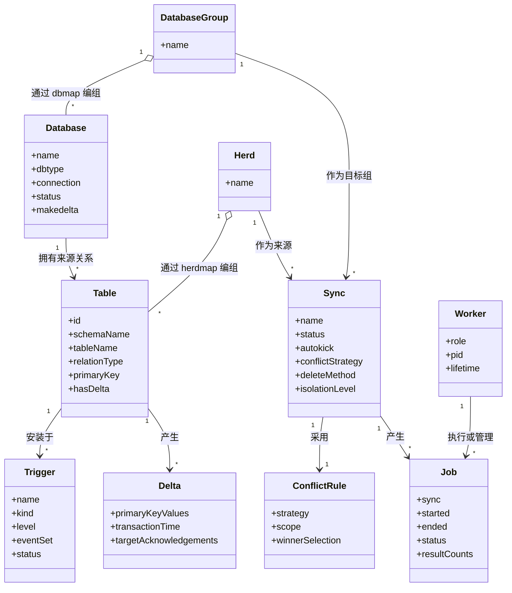
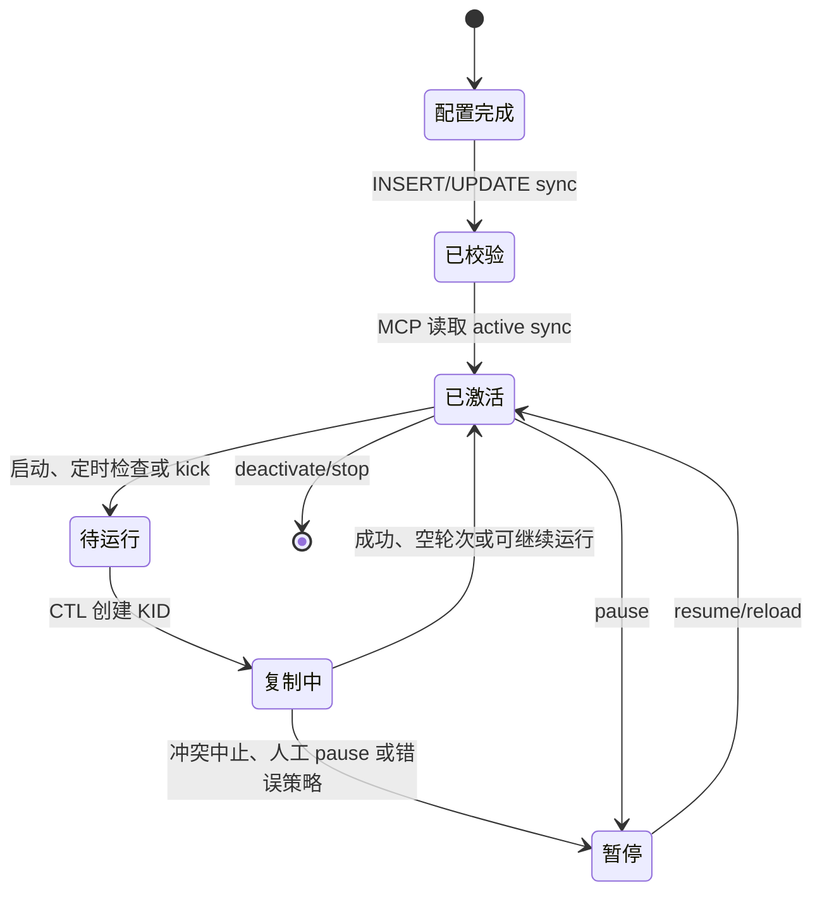
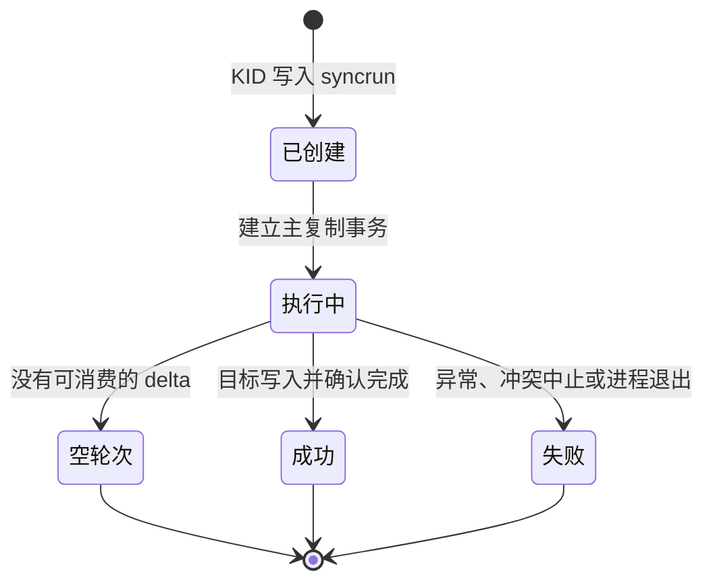
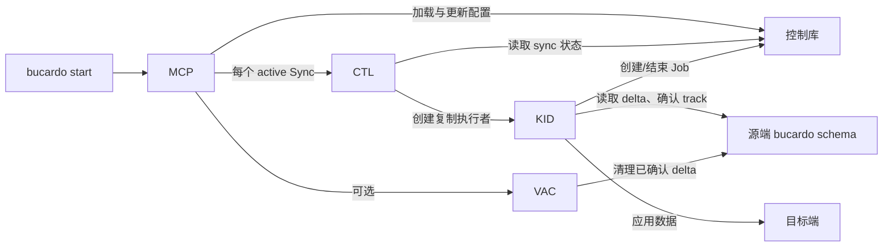

# Bucardo 领域模型

本文档基于 Bucardo 5.6.0 的实现提炼领域模型。模型中的名称保留源码术语，便于从领域概念追溯到 `bucardo.schema` 和 `Bucardo.pm`。

## 模型总览

Bucardo 的核心不是一个中心化的消息队列，而是一个由控制库协调、由源库 delta 表承载变更的复制系统：

- `Database`、`Table` 和 `Sync` 定义复制拓扑；
- `Trigger` 和 `Delta` 实现源端变更捕获；
- `ConflictRule` 在多源同主键变更时选出获胜来源；
- `Job` 表示一次 sync 运行；
- `Worker` 是执行和管理 Job 的运行时进程。

## 1. Database

### 领域定义

`Database` 是 Bucardo 能够连接的命名数据库端点。它是物理连接信息与运行状态的边界，不等同于 PostgreSQL 的实际数据库名：`name` 是 Bucardo 内部使用的逻辑名称，`dbname` 才是实际数据库名。

### 持久化映射

| 实现对象 | 含义 |
|---|---|
| `bucardo.db` | Database 的主记录。 |
| `bucardo.dbgroup` | DatabaseGroup，命名的数据库集合。 |
| `bucardo.dbmap` | Database 与 DatabaseGroup 的成员关系、角色和优先级。 |
| `bucardo.db_connlog` | 数据库连接尝试及结果历史。 |

### 核心属性

| 属性 | 来源 | 说明 |
|---|---|---|
| `name` | `db.name` | Bucardo 内部唯一标识。 |
| `dbtype` | `db.dbtype` | 目标/来源数据库类型；默认 `postgres`。 |
| `connection` | `dbdsn`，或 `dbhost/dbport/dbname/dbuser/dbpass`，或 `dbservice` | 连接描述。 |
| `status` | `db.status` | `active`、`inactive` 或 `stalled`。 |
| `makedelta` | `db.makedelta` | 指示该库中相关表是否需要生成 delta。 |
| `server_side_prepares` | `db.server_side_prepares` | PostgreSQL 预处理语句行为。 |

### 关系与不变量

- 一个 Database 可通过 `dbmap` 属于零个或多个 DatabaseGroup。
- `dbmap.role` 使同一端点在某个组中承担 `source`、`target` 或 `fullcopy` 等角色。
- 一个 `goat`（本文的 Table）归属一个 Database。
- `db` 的状态控制运行时是否可连接和可参与复制；已 stalled 的端点由 MCP 尝试恢复。
- DatabaseGroup 是 Sync 的目标端抽象；Sync 并不直接指向单个目标 Database。

## 2. Table

### 领域定义

`Table` 是可被 Bucardo 管理的复制关系。在实现中它使用历史术语 **Goat**。一个 Goat 可以表示表或 sequence，但涉及 delta 和行复制时，领域对象特指具有主键的表。

### 持久化映射

| 实现对象 | 含义 |
|---|---|
| `bucardo.goat` | Table/Sequence 主记录。 |
| `bucardo.herd` | Herd，源端关系集合。 |
| `bucardo.herdmap` | Table 与 Herd 的多对多关系。 |
| `bucardo.customname` | 目标端表名/schema 映射。 |
| `bucardo.customcols` | 目标端读取/写入列的自定义子句。 |

### 核心属性

| 属性 | 来源 | 说明 |
|---|---|---|
| `id` | `goat.id` | 内部标识。 |
| `database` | `goat.db` | Table 所属的源 Database。 |
| `schemaName` / `tableName` | `schemaname` / `tablename` | 源端关系名。 |
| `relationType` | `reltype` | `table` 或 `sequence`。 |
| `primaryKey` | `pkey`、`qpkey`、`pkeytype` | 表复制与 delta 定位依据。 |
| `hasDelta` | `has_delta` | 是否已经具备 delta 捕获对象。 |
| `autokick` | `goat.autokick` | 可覆盖 sync 的自动唤醒设置。 |
| `ghost` | `goat.ghost` | 仅删除触发器而不复制的特殊关系。 |
| `deltaBypass` | `delta_bypass` 及阈值字段 | 大批量变化时可使用的优化策略。 |

### 关系与不变量

- 一个 Table 属于一个 Database。
- 一个 Table 可属于多个 Herd；但同一个 Herd 中的所有 Table 必须来自同一个 Database，`herdcheck` 触发器负责约束。
- 表类型的 Table 必须有主键。`validate_sync` 在校验阶段拒绝没有主键的表。
- 一个 Table 可在不同 target 或 sync 上具有不同的名称/列映射。
- sequence 不走行级 delta 捕获，而由 KID 读取和调整 sequence 状态。

## 3. Sync

### 领域定义

`Sync` 是复制配置的聚合根：它将一个源 Herd 和一个目标 DatabaseGroup 结合，并定义运行方式、冲突策略和复制策略。

### 持久化映射

| 实现对象 | 含义 |
|---|---|
| `bucardo.sync` | Sync 主记录。 |
| `bucardo.clone` | 基于 sync、herd 与目标组创建 clone 的运行记录。 |
| `bucardo.bucardo_delta_names` | Sync 与实际 delta/track 表名的映射。 |
| `bucardo.bucardo_delta_targets` | 源表与必须消费它的目标组之间的关系。 |

### 核心属性

| 属性 | 来源 | 说明 |
|---|---|---|
| `name` | `sync.name` | Sync 的唯一名称，也是控制通知的一部分。 |
| `sourceHerd` | `sync.herd` | 该 Sync 的源 Table 集合。 |
| `targetGroup` | `sync.dbs` | 目标 DatabaseGroup。 |
| `status` | `sync.status` | 是否参与运行；MCP 根据该状态决定是否激活。 |
| `autokick` | `sync.autokick` | 是否由源端变更通知主动唤醒。 |
| `stayalive` / `kidsalive` | 同名字段 | CTL/KID 是否常驻。 |
| `checktime` | `sync.checktime` | 没有通知时的检查间隔。 |
| `deleteMethod` | `sync.deletemethod` | `delete`、`truncate` 或 `truncate_cascade`。 |
| `conflictStrategy` | `sync.conflict_strategy` | 多源冲突时的默认决策规则。 |
| `isolationLevel` | `sync.isolation_level` | `serializable` 或 `repeatable read`，也可未设置。 |

### 生命周期

### 校验行为

当 Sync 被插入或其名称、Herd、目标组、`autokick` 发生变化时，控制库上的 `validate_sync` 触发器会调用 `bucardo.validate_sync`。它验证表结构和主键，创建源端 delta/track/stage 对象与相关触发器，并更新 delta 元数据。

## 4. Trigger

### 领域定义

`Trigger` 是部署到源端 Table 的数据库内行为。它属于 Sync 的物化运行配置，而不是单纯的控制库声明。Bucardo 至少涉及三类触发行为：

| 类型 | 默认名称 | 时机与粒度 | 领域作用 |
|---|---|---|---|
| Delta trigger | `bucardo_delta` | `AFTER INSERT OR UPDATE OR DELETE`，`FOR EACH ROW` | 把受影响主键写入 Delta。 |
| Kick trigger | `bucardo_kick_<sync>` | `AFTER INSERT OR UPDATE OR DELETE [OR TRUNCATE]`，`FOR EACH STATEMENT` | 在启用 autokick 时发送复制唤醒通知。 |
| Truncate trigger | `bucardo_note_trunc_<sync>` | `AFTER TRUNCATE`，`FOR EACH STATEMENT` | 记录表级 truncate 并重置关联的 delta 状态。 |

### 持久化映射

| 实现对象 | 含义 |
|---|---|
| 源端 `pg_trigger` 与 `pg_proc` | 动态创建的实际 Trigger 和函数。 |
| `bucardo.bucardo_custom_trigger` | 默认 delta 或 triggerkick 行为的按 Table 覆盖定义。 |
| `bucardo.bucardo_truncate_trigger` | 尚未完成复制的 truncate 事件。 |
| `bucardo.bucardo_truncate_trigger_log` | 已按目标端记录的 truncate 复制日志。 |

### 自定义规则

`bucardo_custom_trigger` 的 `trigger_type` 只能是 `delta` 或 `triggerkick`，`trigger_level` 为 `ROW` 或 `STATEMENT`。自定义函数可以覆盖默认实现；它们仍由 Sync 校验阶段安装到源端。

## 5. Delta

### 领域定义

`Delta` 是“某个 Table 的某个主键在某个时间发生过变化”的耐久化事实。它并不是完整的变更事件：没有操作类型、没有行镜像，也没有业务版本号。

### 持久化映射

| 实现对象 | 结构与用途 |
|---|---|
| `bucardo.delta_<makername>` | 每个受跟踪表一张；主键列加 `txntime`，构成源端变更队列。 |
| `bucardo.track_<makername>` | `txntime` 和 `target`；标记某目标已消费该 delta。 |
| `bucardo.stage_<makername>` | `txntime` 和 `target`；目标提交相关的暂存确认信息。 |
| `bucardo.bucardo_delta_names` | 将 sync/table 映射到物理 delta 和 track 表名。 |
| `bucardo.bucardo_delta_targets` | 定义清理前必须确认消费的目标组。 |

### 属性与规则

| 属性 | 含义 |
|---|---|
| `primaryKeyValues` | 被 INSERT、UPDATE 或 DELETE 影响的源表主键值。 |
| `transactionTime` | `txntime`；默认由源端 `now()` 生成。 |
| `acknowledgedTargets` | 不在 Delta 行内；由相同 `txntime` 的 track/stage 记录表达。 |

Delta 的生成规则：

| 操作 | 写入 Delta 的主键 |
|---|---|
| `INSERT` | `NEW` 主键。 |
| `UPDATE` | `OLD` 主键；若主键变化，再写入 `NEW` 主键。 |
| `DELETE` | `OLD` 主键。 |

### 重要语义

- Delta 表可以有重复项；它不是主键去重队列。
- KID 不从 Delta 获取完整行，而是按 Delta 主键重新读取源表的当前状态。
- 因此，若当前源端已经不存在该行，KID 走目标端删除路径。
- KID 在目标端提交后记录消费状态；VAC 仅删除所有必需目标组均已确认的 Delta。
- `TRUNCATE` 不生成每行 Delta，而是使用独立的 truncate 事件记录。

## 6. ConflictRule

### 领域定义

`ConflictRule` 定义多个来源在同一个复制轮次中对**同一 Table 的同一主键**都产生 Delta 时，哪个来源的数据获胜，或是否应停止复制。

### 实现定位

ConflictRule 不是独立数据库表。它主要由以下内容共同表达：

| 层级 | 实现 | 作用 |
|---|---|---|
| 全局默认 | `bucardo_config.default_conflict_strategy` | Sync 未提供策略时的回退值。 |
| Sync 配置 | `sync.conflict_strategy` | 当前实现中 KID 使用的有效策略来源。 |
| Table 元数据 | `goat.conflict_strategy` | schema 中存在该列；但当前 `Bucardo.pm` 为每个 goat 计算有效策略时取 Sync 值或全局默认，而非该列。 |
| 动态规则 | `customcode` 的 `conflict` hook | 可在运行时修改每个冲突主键的获胜来源，或设置表/Sync 级获胜者。 |

### 冲突检测

KID 以主键为键比较多个来源的 delta 集合。若同一主键同时出现在两个或更多来源的集合中，即构成冲突。随后 KID 从候选来源中保留一个获胜者，并从其他来源的待复制集合中移除该主键。

### 内建策略

| 策略 | 行为 |
|---|---|
| `bucardo_abort` | 检测到冲突后暂停并结束该 Sync。 |
| `bucardo_custom` | 要求存在自定义 conflict hook；没有可用 hook 时暂停 Sync。 |
| `bucardo_latest` | 比较冲突 Table 在各来源 delta 中的最大 `txntime`；较新的来源优先。时间相同则按数据库名排序。 |
| `bucardo_latest_all_tables` | 以该 Sync 所有表的最大 `txntime` 确定来源优先级；同一轮次对所有 Table 复用该优先级。 |
| 来源名称或来源名称列表 | 可显式将一个来源、或按优先级排列的来源列表设为获胜候选。 |

### 自定义规则作用域

自定义 conflict hook 可返回临时决策，作用范围依次可为：

| 决策 | 作用范围 | 生命周期 |
|---|---|---|
| `tablewinner` | 当前 Table | 当前处理阶段。 |
| `tablewinner_always` | 当前 Table | 直到该 Sync 重启。 |
| `syncwinner` | 当前 Sync 的所有表 | 当前处理阶段。 |
| `syncwinner_always` | 当前 Sync 的所有表 | 直到该 Sync 重启。 |

## 7. Job

### 领域定义

`Job` 表示一次 Sync 运行实例：从 KID 开始执行，到成功、失败或确认无变化结束。它是运行历史和状态查询的主要单位。

### 持久化映射

| 实现对象 | 含义 |
|---|---|
| `bucardo.syncrun` | Job 的持久化记录。 |
| `bucardo.dbrun` | Job 执行期间正在使用的数据库 backend 记录；它不是 Job 主表。 |

### 核心属性

| 属性 | 来源 | 说明 |
|---|---|---|
| `sync` | `syncrun.sync` | Job 所属 Sync。 |
| `started` / `ended` | 同名字段 | Job 的起止时间。 |
| `status` / `details` | 同名字段 | 当前阶段或最终结果说明。 |
| `inserts` / `deletes` / `truncates` | 同名字段 | 本次复制的数据变更计数。 |
| `conflicts` | `syncrun.conflicts` | 本次处理的冲突数量。 |
| `lastgood` / `lastbad` / `lastempty` | 同名字段 | 标识该 Sync 最近一次成功、失败或空轮次。 |

### 生命周期与状态

实现没有为 `syncrun` 定义独立的业务主键；运行时通过“同一 Sync 且 `ended IS NULL`”定位进行中的 Job。部分更新使用 PostgreSQL 的 `ctid` 定位当前记录。因此，领域上应将 Job 视为**每个 Sync 同时至多一个活动运行实例**。

## 8. Worker

### 领域定义

`Worker` 是实际执行或管理复制的操作系统进程。它不是单独的持久化领域表，而是由 PID 文件、控制库运行记录和内存状态共同表示的运行时实体。

### Worker 类型

| 类型 | 创建者 | 生命周期 | 职责 |
|---|---|---|---|
| MCP | CLI `start` | 全局单例守护进程 | 加载配置、管理 Sync、监听通知、健康检查、创建 CTL/VAC。 |
| CTL | MCP | 每个 active Sync 一个 | 管理单个 Sync，处理控制事件，创建和监督 KID。 |
| KID | CTL | 每次执行或持续运行 | 执行 Job：读 Delta、读源表、写目标、处理冲突、记录确认。 |
| VAC | MCP | 可选全局后台进程 | 清理已被所有必需目标确认的 Delta。 |

### 持久化与可观测映射

| 实现对象 | 表达的 Worker 状态 |
|---|---|
| PID 文件 | MCP、CTL、KID、VAC 的操作系统进程身份和控制入口。 |
| `bucardo.dbrun` | 某个 Sync 正在使用的数据库 backend PID 和开始时间。 |
| `bucardo.syncrun` | KID 当前/历史 Job 的阶段与结果。 |
| MCP 内存中的 PID 映射 | 用于识别通知来源和避免 KID 自触发的复制循环。 |

### Worker 协作关系

## 聚合边界与一致性

| 聚合或边界 | 根实体 | 强一致性规则 |
|---|---|---|
| 数据库拓扑 | DatabaseGroup | 成员关系由 `dbmap` 表达；Database 可加入多个组。 |
| 源关系集合 | Herd | 所有成员 Table 必须来自同一 Database。 |
| 复制配置 | Sync | 必须引用一个 Herd 和一个目标 DatabaseGroup；关键变化触发重新校验和源端对象部署。 |
| 源端变更状态 | Table 的 Delta 集合 | Delta、Stage、Track 使用相同 `txntime` 关联；清理必须等待所需目标确认。 |
| 运行实例 | Job | 一个 Sync 在逻辑上只应有一个 `ended IS NULL` 的活动 Job。 |
| 冲突决策 | ConflictRule | 决策的最小对象是“Table + 主键 + 候选来源集合”；最终必须归约为一个获胜来源。 |

## 术语对照

| 领域术语 | Bucardo 术语/实现名称 |
|---|---|
| Database | `db` |
| DatabaseGroup | `dbgroup` |
| Table | `goat`，可包含 sequence |
| TableGroup | `herd` |
| Sync | `sync` |
| Trigger | `bucardo_delta`、`bucardo_kick_*`、`bucardo_note_trunc_*` |
| Delta | `delta_*` 行及其 `track_*`、`stage_*` 确认状态 |
| ConflictRule | `conflict_strategy` 与 conflict customcode |
| Job | `syncrun` |
| Worker | MCP、CTL、KID、VAC 进程 |
